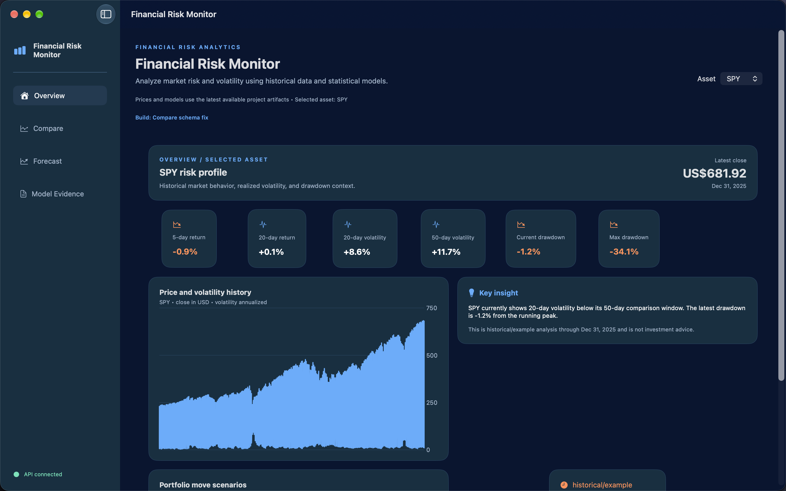
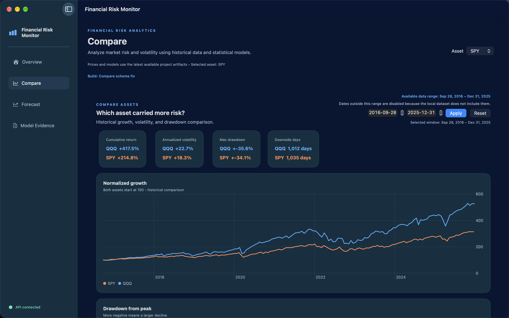
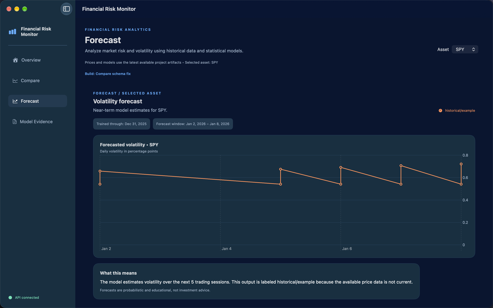
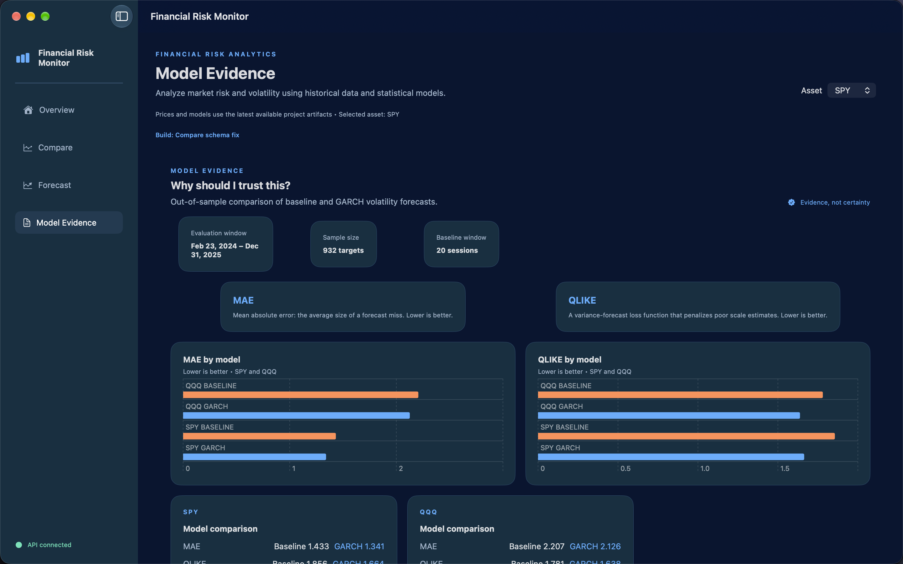

# Financial Risk & Volatility Monitor

Financial Risk & Volatility Monitor is a portfolio-ready analytics product for exploring historical price behavior, realized volatility, drawdowns, and short-horizon volatility forecasts for SPY and QQQ.

It combines a Python data science pipeline, a FastAPI service, and a native SwiftUI iOS/macOS dashboard designed as a dense fintech-style analyst interface.

> Educational analytics only. The repository uses a validated historical data snapshot through 2025-12-31. Forecasts are labeled historical/example when the available data is stale and are not investment advice.

## Problem

Risk metrics are often presented as disconnected model outputs. This project turns them into a user-facing workflow that answers four practical questions:

- What is happening with the selected asset?
- Which asset carried more risk?
- What does the volatility model estimate next?
- Why should the model evidence be trusted?

## Product Features

- Overview: asset summary, returns, volatility, drawdown, chart history, insight copy, and dollar scenarios.
- Compare: SPY versus QQQ growth, volatility, drawdown, and downside-day comparison with date controls.
- Forecast: selected-symbol baseline and GARCH forecasts with cutoff dates, generation time, and stale-data warnings.
- Model Evidence: MAE and QLIKE comparison, evaluation window, sample size, per-symbol winners, and expandable ACF/PACF diagnostics.
- Explicit freshness contract shared by dashboard and API.
- Cached/reused forecast work within the API process.
- Streamlit dashboard retained as a fallback and validation reference.
- SwiftUI is the primary portfolio UI for iOS and macOS.

## Architecture

```text
Nasdaq historical snapshot -> SQLite store + metadata artifacts
                              |-> dashboard_data.py loaders and freshness contract
                              |-> FastAPI typed JSON contracts
                                  |-> SwiftUI iOS/macOS application
                                  |-> React optional web reference/fallback
```

Backend modules live under `src/risk_monitor/`. The primary UI lives under `ios-macos/`. React under `frontend/` is an optional web reference/fallback. Streamlit under `dashboard/app.py` is a legacy/prototype fallback.

## Setup

Requirements: Python 3.11, Xcode 27 or newer, and macOS for the native app. Node.js/npm are only needed for the optional React reference.

```bash
cd Data_Science_Lab_Project
python3.11 -m venv .venv
source .venv/bin/activate
python -m pip install --upgrade pip setuptools wheel
python -m pip install -r requirements.txt
cd ios-macos
swift test
```

## Run the Primary Product

Terminal 1:

```bash
.venv/bin/python scripts/run_api.py
```

Then open `ios-macos/FinancialRiskMonitor.xcodeproj` in Xcode, select the `FinancialRiskMonitorApp` scheme, choose `My Mac` or an iPhone Simulator, and press `Cmd+R`.

Optional React web reference, Terminal 2:

```bash
cd frontend
npm run dev
```

Open `http://127.0.0.1:5173`.

Streamlit legacy/prototype fallback: `.venv/bin/streamlit run dashboard/app.py`.

## API Examples

```bash
curl http://127.0.0.1:8000/health
curl http://127.0.0.1:8000/symbols
curl http://127.0.0.1:8000/overview/SPY
curl http://127.0.0.1:8000/compare
curl http://127.0.0.1:8000/evidence
curl -X POST http://127.0.0.1:8000/forecast -H 'Content-Type: application/json' -d '{"symbol":"SPY","horizon":5}'
```

## Verification

```bash
.venv/bin/ruff check src scripts tests dashboard
MPLCONFIGDIR=.cache/matplotlib .venv/bin/pytest -q
cd frontend && npm run lint && npm run build
cd ../ios-macos
swift test
xcodebuild -project FinancialRiskMonitor.xcodeproj -scheme FinancialRiskMonitorApp -destination 'platform=macOS' build
xcodebuild -project FinancialRiskMonitor.xcodeproj -scheme FinancialRiskMonitorApp -destination 'platform=iOS Simulator,name=iPhone 18 Pro Max' build
```

## Refreshing Data

The checked-in outputs are a historical example. Run the refresh workflow in `docs/dashboard.md`, then rerun validation, tests, and smoke checks. Never remove freshness labels when refreshing or deploying data.

## Limitations

- The current data snapshot ends on 2025-12-31 and is not live market data.
- Returns use raw close values; adjusted-price and corporate-action treatment requires additional work.
- GARCH results are evidence from a defined historical window, not a guarantee of future accuracy.
- The frontend requires FastAPI for live page data.
- Outputs are educational and not investment advice.

## Further Reading

- `docs/case-study.md` - project narrative and results.
- `docs/dashboard.md` - product behavior and refresh workflow.
- `docs/api.md` - local API contract.
- `docs/recruiter-assets.md` - résumé, LinkedIn, GitHub, and demo copy.

## Screenshots

### Overview


### Compare


### Forecast


### Model Evidence

